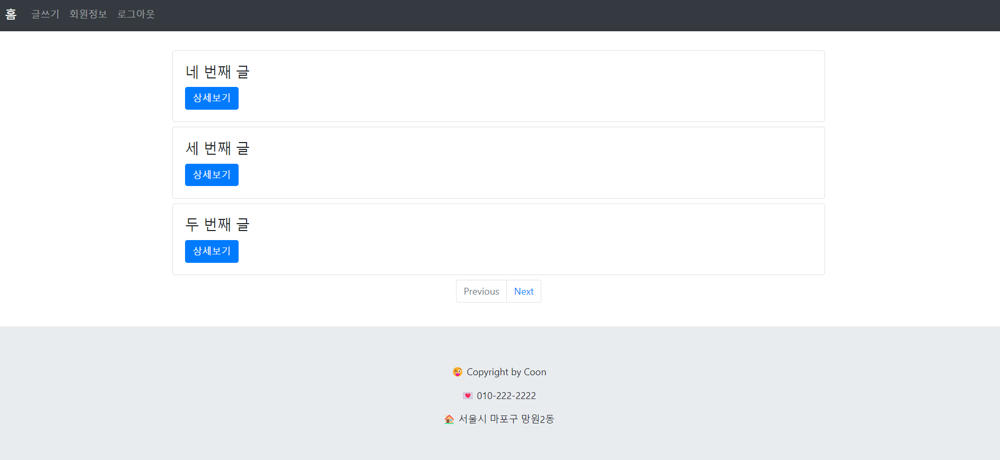
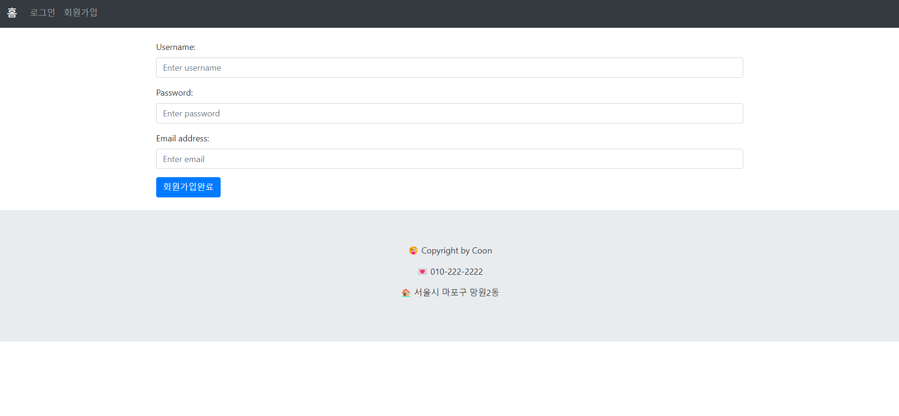
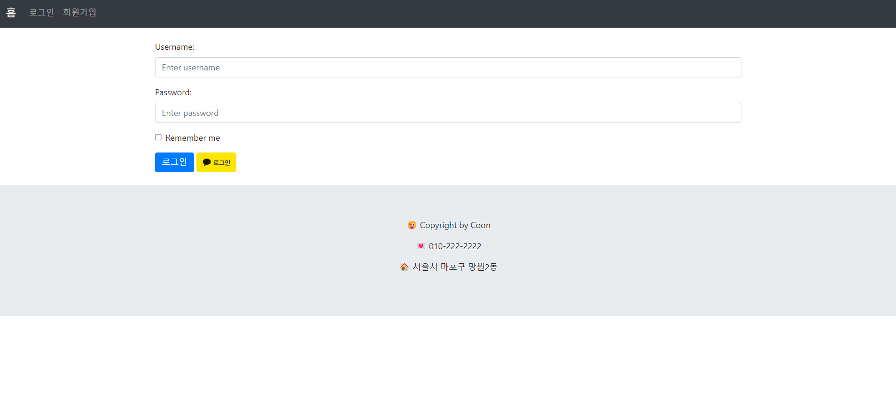
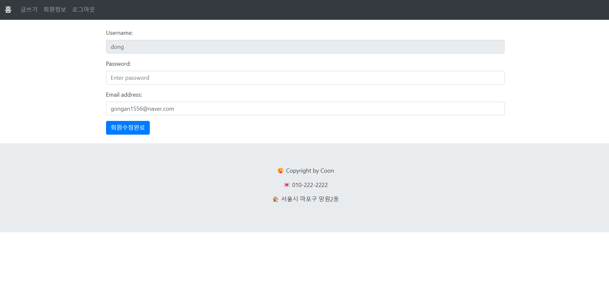
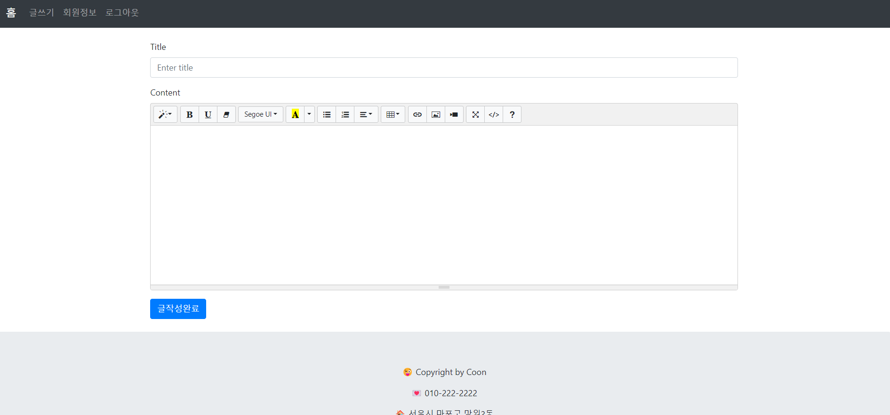
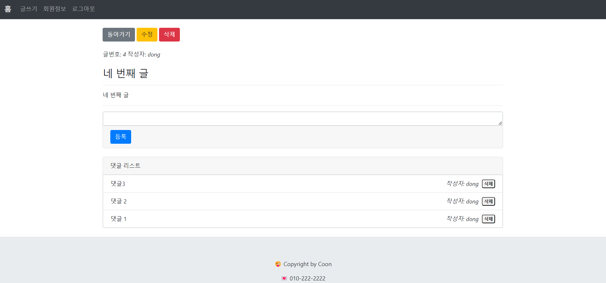

# 간단한 블로그 만들기

<p align="center"></p>

## 프로젝트 정보
* 일반적인 게시판의 기능을 구현한 간단한 개인 블로그 프로젝트!!
* 강의를 보고 클론 코딩하며 여러 기술스택 습득하며 공부!! 
* 차후 다른 기술스택 및 인프라를 이용하여 배포까지!!
* 디자인도 차후 다양한 프레임워크나 라이브러리 이용해서 커스텀!!


## 배포 주소
* 아직 미배포


## 기술 스택
* Springboot 2.7.9 version
* Java 11
* JPA
* Spring Security
* JSTL 1.2 version
* MariaDB (AWS RDS)
* JSP


## 주요 기능

### 🪄홈
* 네비게이션바: 로그인 전 - 홈/로그인/회원가입 -> 로그인 후 홈/글쓰기/회원정보/로그아웃
* 모든 사용자의 게시물을 페이지당 3개씩 페이징하여 세로로 배열
### 🪄로그인
* 일반 로그인과 카카오 로그인 가능.
* 홈화면을 제외한 모든 주소에서 session이 존재하지 않으면 로그인 화면으로 이동.
### 🪄회원가입
* 이름, 비밀번호, 이메일 값을 입력받음.
* 추후 게시판 업데이트시 필요한 변수 추가.
### 🪄회원정보
* 일반회원일 경우 비밀번호와 이메일 변경가능, kakao로그인일 경우 변경 불가.
### 🪄글쓰기
* 제목, 내용 값 입력받음. (내용은 text editor 포함)
* 로그인한 사용자가 작성한 게시물만 수정, 삭제가능
### 🪄댓글
* 댓글 값 입력받음.
* 댓글 입력한 사용자만 삭제 버튼 노출

## 화면구성
메인 페이지|회원가입 페이지
---|---
|<p align="center"></p>
로그인 페이지|회원정보 페이지
---|---
|
글쓰기 페이지|글정보 페이지
---|---
|


## 디렉토리 구조
```bash
├── README.md
├── build.gradle
├── .gitignore
├── myblogspringboot : 
│   ├── config : 
│   │   ├── auth : security 관련 인증, 인가 설정
|   |   |    ├── PrincipalDetail.java
|   |   |    └── PrincipalDetailService.java
│   │   ├── SecurityConfig.java
│   ├── controller : RestController와 Controller 구분
│   │   ├── api : RestController
|   |   |    ├── BoardApiController.java
|   |   |    └── UserApiController.java
│   │   ├── BoardController.java
│   │   ├── UserController.java
│   ├── dto :
│   │   ├── ReplySaveRequestDto.java: 댓글 저장 시 이용.
│   │   └── ResponseDto.java : 에러코드 출력
│   ├── handler : 
│   │   └── GlobalExceptionHandler.java : 모든 에러코드 출력
│   ├── model : 
│   │   ├── Board.java
│   │   ├── KakaoProfile.java
│   │   ├── OAuthToken.java
│   │   ├── Reply.java
│   │   ├── RoleType.java
│   │   └── User.java
│   ├── repository : 
│   │   ├── BoardRepository.java
│   │   ├── UserRepository.java
│   │   └── ReplyRepository.java
│   └── service :
│       ├── BoardService.java
│       └── UserService.java
├── resources : 프론트엔드
|   ├── static :
|   │   ├── image :
|   |   |    └── kakao_login_button.png
|   │   └── js :
|   |        ├── board.js
|   |        └── user.js
|   └── application.yml
└── webapp
    └── WEB-INF :
         └── views :
              ├── board 
              |    ├ detail.jsp
              |    ├ saveForm.jsp
              |    └ updateForm.jsp
              ├── layout
              |    ├ footer.jsp
              |    └ header.jsp
              ├── user
              |    ├ joinForm.jsp
              |    ├ loginForm.jsp
              |    └ updateForm.jsp
              └── index.jsp

```

## 이슈 및 업데이트할 내용
* 카테고리별 게시글 분류
* 기타 에러 찾기.
* 구글, 페이스북, 네이버 등의 기타 OAuth 추가
* JWT 토큰방식 추가
* React, Flutter 실습
* AWS 이용 Jenkins로 자동배포
* 무료 도메인 찾기!


